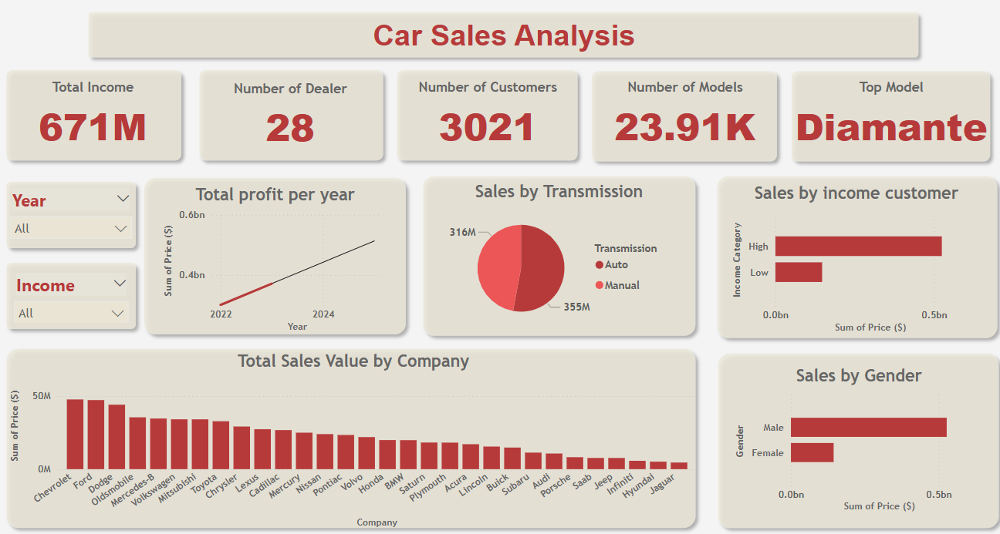

# 🚗 Car-Sales-Analysis

This project analyzes car sales data using Python and Power BI.  
The goal is to clean, preprocess, and visualize the data to extract valuable insights that help understand sales patterns and customer behavior.

---

## 🧰 Tools & Technologies Used

- Google Colab (Python environment)
- Python Libraries:
  - `pandas` – for data cleaning and manipulation  
  - `numpy` – for numerical operations  
  - `seaborn`, `matplotlib.pyplot` – for visualization  
  - `sklearn.preprocessing.LabelEncoder` – for encoding categorical features  
  - `matplotlib.colors.LinearSegmentedColormap` – for customizing plots
- Power BI – for interactive data dashboards

---

## 🔍 Workflow

1. **Dataset Exploration & ERD**
   - Explored relationships and patterns between features
   - Built an ERD to understand data structure

2. **Preprocessing & Cleaning**
   - Handled missing values, duplicates, and column formatting
   - Encoded categorical features using `LabelEncoder`
   - Created and saved a cleaned version of the dataset

3. **Data Analysis & Visualization**
   - Used Seaborn and Matplotlib to create visual insights
   - Identified trends and relationships in sales 

4. **Power BI Dashboard**
   - Imported cleaned dataset into Power BI
   - Designed interactive visualizations and filters
   - Extracted key insights for decision-making

---

## 📁 Project Files

| File                  | Description                          |
|-----------------------|--------------------------------------|
| `Car_Sales_Analysis.ipynb` | Python notebook with full workflow |
| `data_raw.csv`         | Raw dataset                         |
| `data_cleaned.csv`     | Cleaned dataset for Power BI        |
| `dashboard.pbix`       | Power BI dashboard file             |
| `presentation.pdf`     | Project presentation slides         |

---

## 📸 Sample Visuals

### Power BI Dashboard

---

## ✅ Project Status

✔️ Completed – Ready for showcasing, feedback, or further enhancement.

---

## 💬 Contact

For any inquiries or feedback:  
📧 dareenhesham2002@gmail.com  
🔗 GitHub: [dareenhesham](https://github.com/dareenhesham)
